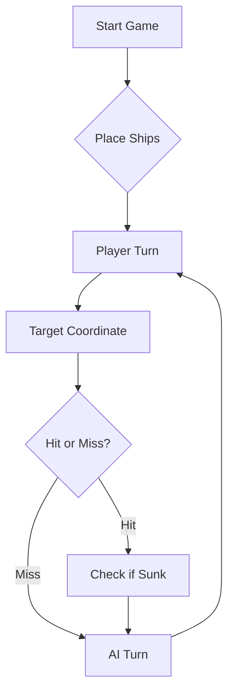

# Battleship2 – Ficha 2 de Engenharia de Software

| Curso  | Número | Nome          | GitHub    |
|--------|--------|---------------|-----------|
| LEI-PL | 87907  | Pedro Vicente | LEI-87907 |

- **Vídeo de demonstração:** *(link do YouTube a acrescentar)*
- **User story implementada:** [#1 Exportar o histórico de rajadas para PDF](https://github.com/LEI-87907/Battleship2/issues/1)
- **Documentação (GitHub Pages):** https://lei-87907.github.io/Battleship2/

---

# ⚓ Battleship 2.0


> A modern take on the classic naval warfare game, designed for the XVII century setting with updated software engineering patterns.

---

## 📖 Table of Contents
- [Project Overview](#-project-overview)
- [Key Features](#-key-features)
- [Technical Stack](#-technical-stack)
- [Installation & Setup](#-installation--setup)
- [Code Architecture](#-code-architecture)
- [Roadmap](#-roadmap)
- [Contributing](#-contributing)

---

## 🎯 Project Overview
This project serves as a template and reference for students learning **Object-Oriented Programming (OOP)** and **Software Quality**. It simulates a battleship environment where players must strategically place ships and sink the enemy fleet.

### 🎮 The Rules
The game is played on a grid (typically 10x10). The coordinate system is defined as:

$$(x, y) \in \{0, \dots, 9\} \times \{0, \dots, 9\}$$

Hits are calculated based on the intersection of the shot vector and the ship's bounding box.

---

## ✨ Key Features
| Feature | Description | Status |
| :--- | :--- | :---: |
| **Grid System** | Flexible $N \times N$ board generation. | ✅ |
| **Ship Varieties** | Galleons, Frigates, and Brigantines (XVII Century theme). | ✅ |
| **AI Opponent** | Heuristic-based targeting system. | 🚧 |
| **Network Play** | Socket-based multiplayer. | ❌ |

---

## 🛠 Technical Stack
* **Language:** Java 17
* **Build Tool:** Maven / Gradle
* **Testing:** JUnit 5
* **Logging:** Log4j2

---

## 🚀 Installation & Setup

### Prerequisites
* JDK 17 or higher
* Git

### Step-by-Step
1. **Clone the repository:**
   ```bash
   git clone [https://github.com/britoeabreu/Battleship2.git](https://github.com/britoeabreu/Battleship2.git)
   ```
2. **Navigate to directory:**
   ```bash
   cd Battleship2
   ```
3. **Compile and Run:**
   ```bash
   javac Main.java && java Main
   ```

---

## 📚 Documentation

You can access the generated Javadoc here:

👉 [Battleship2 API Documentation](https://britoeabreu.github.io/Battleship2/)


### Core Logic
```java
public class Ship {
    private String name;
    private int size;
    private boolean isSunk;

    // TODO: Implement damage logic
    public void hit() {
        // Implementation here
    }
}
```

### Design Patterns Used:
- **Strategy Pattern:** For different AI difficulty levels.
- **Observer Pattern:** To update the UI when a ship is hit.
</details>

### Logic Flow


---

## 🗺 Roadmap
- [x] Basic grid implementation
- [x] Ship placement validation
- [ ] Add sound effects (SFX)
- [ ] Implement "Fog of War" mechanic
- [ ] **Multiplayer Integration** (High Priority)

---

## 🧪 Testing
We use high-coverage unit testing to ensure game stability. Run tests using:
```bash
mvn test
```

> [!TIP]
> Use the `-Dtest=ClassName` flag to run specific test suites during development.

---

## 🤝 Contributing
Contributions are what make the open-source community such an amazing place to learn, inspire, and create.

1. Fork the Project
2. Create your Feature Branch (`git checkout -b feature/AmazingFeature`)
3. Commit your Changes (`git commit -m 'Add some AmazingFeature'`)
4. Push to the Branch (`git push origin feature/AmazingFeature`)
5. Open a **Pull Request**

---

## 📄 License
Distributed under the MIT License. See `LICENSE` for more information.


---
**Maintained by:** [@britoeabreu](https://github.com/britoeabreu)  
*Created for the Software Engineering students at ISCTE-IUL.*


---

## Treino do oponente de IA - Protocolo de comunicação (Parte C)

**LLM utilizado:** Claude (Anthropic)

1. Expliquei as regras da Batalha Naval dos Descobrimentos com o prompt da secção C2 do guião.
2. Pedi 4 tabuleiros, com o Galeão virado a Norte, Sul, Este e Oeste. Os 4 respeitaram as regras: 11 navios, sem contacto entre navios e Galeão em forma de T.
3. Ensinei o protocolo JSON com *few-shot prompting*. 
4. Joguei várias rajadas: introduzi cada rajada do LLM no programa e devolvi o JSON gerado.
5. O LLM confirmou que domina o protocolo.


<details>
<summary><b>Prompts utilizados na Parte C</b> (clicar para expandir)</summary>

**1. Regras do jogo (C2):** prompt do guião, sem alterações.

**2. Verificação dos tabuleiros (C3):**
```
Mostre-me um tabuleiro criado com estas regras, com o Galeão virado a Norte. Deixa as posições da água em branco para melhor visualização das posições dos navios.
Mostre-me um tabuleiro criado com estas regras, com o Galeão virado a Sul.
Mostre-me um tabuleiro criado com estas regras, com o Galeão virado a Este.
Mostre-me um tabuleiro criado com estas regras, com o Galeão virado a Oeste.
```

**3. Protocolo JSON (C4), com o formato da rajada corrigido para array:**
```
A nossa interação será através de objetos JSON, quer para a rajada de 3 tiros, quer para a correspondente resposta. Uma rajada tem o seguinte formato (um array com 3 tiros):
[ {"row": "A", "column": 5}, {"row": "C", "column": 10}, {"row": "F", "column": 5} ]
A resposta a uma rajada é feita em conjunto e não tiro a tiro 
Manda agora várias rajadas de tiros (uma de cada vez) e eu devolvo o JSON da resposta. Pare só quando tiver aprendido o protocolo de comunicação do jogo.
```

</details>


---

## Treino do oponente de IA - Estratégia do jogo (Parte D)

Joguei 2 jogos completos contra o LLM. O LLM disparava as rajadas em JSON, eu introduzia-as no programa (`rajada X1 Y2 Z3`) e devolvia o JSON da resposta. Nos dois jogos o LLM afundou a frota inteira.

| | Jogo 1 (prompt do guião) | Jogo 2 (prompt melhorado) |
|---|---|---|
| Rajadas até afundar a frota | 20 | 22 |
| Tiros certeiros | 27/60 (45%) | 27/66 (41%) |

**Erros observados no jogo 1, que levaram às melhorias do prompt:**
1. Depois de acertar num navio, usava só 1 dos 3 tiros para o perseguir.
2. Disparava para o lado de um navio que já tinha dado água (ex.: B3, quando B4 era água e a Nau só podia continuar para B7).
3. Disparava em diagonais de tiros certeiros (ex.: B1, diagonal de A2 e C2).
4. Não tratava as respostas ambíguas (ex.: "Barca afundada em F10 ou I4") e disparava depois no halo de uma das hipóteses.
5. A meio do jogo chegou a demorar vários minutos por jogada, a reanalisar o tabuleiro inteiro.

**Conclusões:** no jogo 2, a perseguição de navios atingidos melhorou claramente (2 a 3 tiros por rajada nas casas contíguas) e deixou de haver tiros em diagonais e halos. O número de rajadas não baixou por dois motivos: houve azar na exploração inicial (9 tiros na água nas 3 primeiras rajadas) e, como a resposta do protocolo é agregada, a frota com muitos navios pequenos nos cantos gerou muitas respostas ambíguas na fase final. O LLM guardou o Diário de Bordo num ficheiro (`diario_jogo.md`), o que resolveu o problema de memória entre jogadas.

### Prompt final da estratégia

```
Considere a seguinte tática de geração de rajadas de tiros.
• Crie um Diário de Bordo com o registo de cada rajada disparada, numerando-as sequencialmente (Rajada 1, 2, 3...). Guarde as coordenadas exatas de cada tiro e o respetivo resultado (Água, Nau atingida, Barca afundada, etc.). A memória é a principal arma de um bom estratega.
• Não dispare fora dos limites do mapa (ex: Z99) nem repita tiros em coordenadas já testadas. A única exceção para este desperdício de pólvora é a última rajada do jogo, apenas para perfazer os 3 tiros obrigatórios quando a frota inimiga já estiver irremediavelmente no fundo do mar.
• Se atingir um navio numa rajada, dispare nas posições contíguas (Norte, Sul, Este, Oeste) na jogada seguinte para descobrir a orientação da embarcação e acabar de a afundar. No entanto, se a rajada anterior confirmar que o navio já foi afundado, não dispare para as posições contíguas, pois os navios nunca estão encostados.
• Prioridade à caça: enquanto houver um navio atingido e não afundado, use os 3 tiros da rajada nas posições contíguas desse navio, e não em exploração.
• Quando já souber a orientação de um navio e uma das extremidades já tiver dado água, dispare apenas para a outra extremidade.
• Como as Caravelas, Naus e Fragatas são linhas retas, um tiro certeiro significa que o resto do navio está na horizontal ou na vertical. Como os navios não se podem tocar (nem sequer nos cantos), as posições diagonais a um tiro certeiro são garantidamente água (a única exceção é o corpo do Galeão, devido à sua forma em T). Evitar estas diagonais poupa imensos tiros. Esta regra aplica-se também quando não sabe qual dos tiros acertou: as diagonais de todos os candidatos são de evitar.
• Quando o relatório de uma rajada confirmar que um navio foi afundado (ex: Fragata de 4 posições), analise os dados do seu Diário de Bordo para identificar exatamente onde caíram esses tiros. Confirmada a posição exata da carcaça, marque todas as quadrículas adjacentes (o halo de 1 posição em redor do navio) como água intransitável. É impossível haver outra embarcação nesse perímetro.
• Respostas ambíguas: como a resposta é agregada, pode não saber qual dos tiros afundou um navio (ex: "Barca afundada" com tiros em F10 e I4). Nesse caso, registe as hipóteses no Diário e trate o halo de todas elas como zona de baixa prioridade até a ambiguidade ficar resolvida.
• Na exploração, escolha casas afastadas dos tiros anteriores e dos halos, onde ainda caibam os navios que faltam afundar.
• Seja conciso: em cada jogada atualize o Diário e responda apenas com a rajada em JSON e uma linha de justificação.
• Se a sua frota for toda afundada, declare a derrota com honra. Em contrapartida, seja um vencedor magnânimo se for o inimigo a render-se com os navios todos no fundo do oceano!
```
